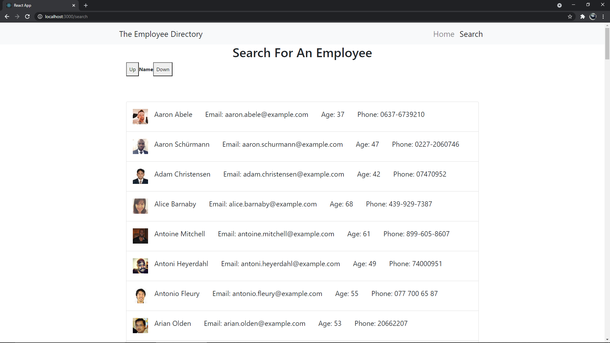
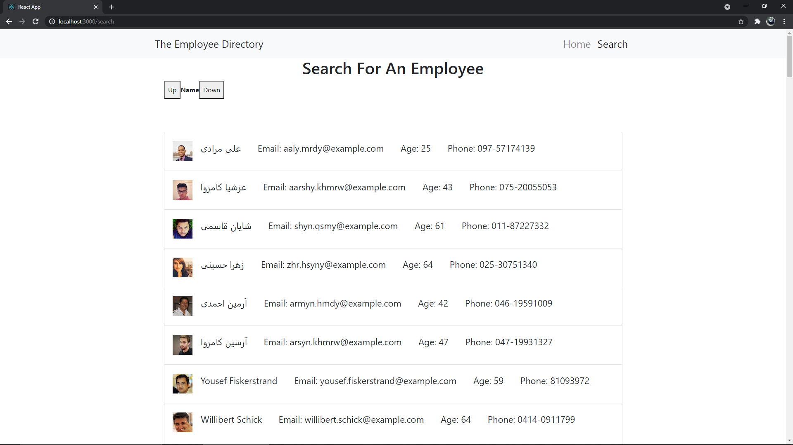
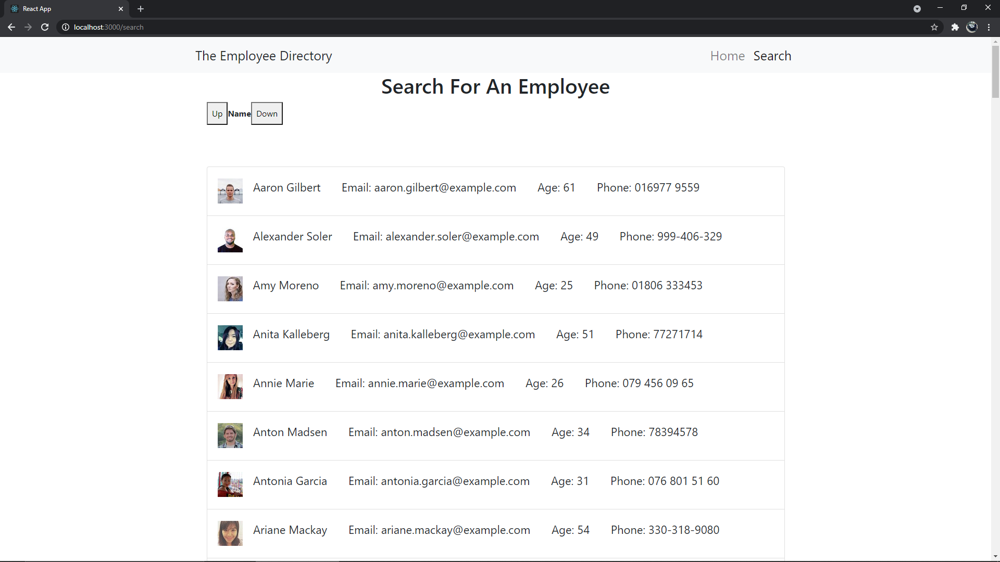

# Employee Directory 

## Description

- This application is a Employee Directory where a user can search and filter employees from name top or bottom. 
 
- This app was created with React.

- The employee information is brought in by a 3rd party api.

- That info is then rendered to the search results page using render and React Router. 

- This app is reliant on the use of Props and React State. 

## Screenshots

Search Up

Search Down

New Search

## Installation

To check the project, I worked on click on these links: 

GitHub: https://github.com/NBP77/employee-directory-

Deployed app: 

## Usage

- Fully functional React app 
- Using JSX syntax we are able to easily write front end looking code in the javascript files.
- Employees can be sorted by name.
- Future development, this wil be part of a full MERN stack application.

## Tech Used: 

- React, Javascript, JSX
- Ajax, 3rd party API
- Express, Node.JS
- manifest.webmanifest
- Many more..

## Credits

I was able to do most of this based of the activities we have done in class.